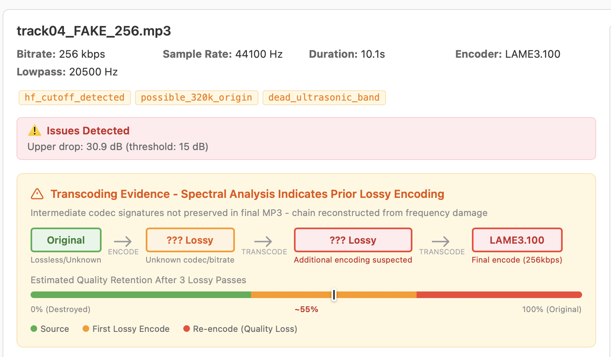
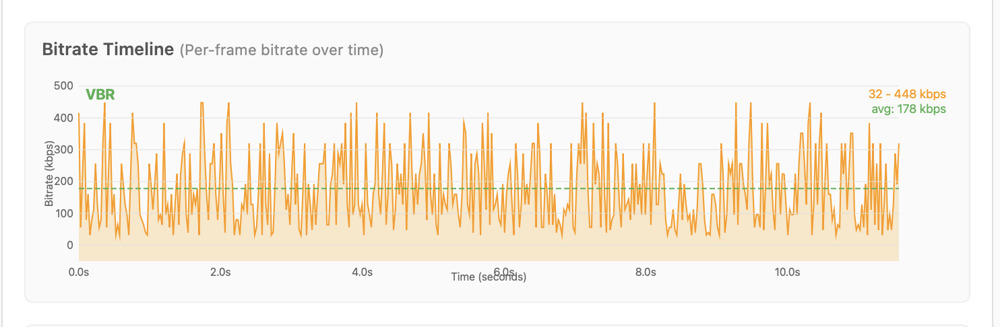
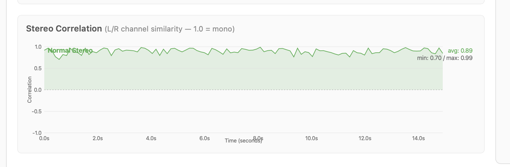

# Losselot

**Find out if your "lossless" audio files are actually lossless.**

Ever downloaded a FLAC or WAV and wondered if it's the real deal, or just an MP3 someone converted? Losselot tells you the truth in seconds.


---

## Try It Now

Clone and run in 30 seconds:

```bash
git clone https://github.com/notactuallytreyanastasio/losselot.git
cd losselot
cargo build --release
./target/release/losselot serve examples/ --port 3000
```

Open [http://localhost:3000](http://localhost:3000) and explore the interactive UI. The `examples/` folder contains test files demonstrating different encoding scenarios - transcodes, re-encodes, and clean files.

**No test files yet?** Generate them:

```bash
cd examples && ./generate_test_files.sh && cd ..
./target/release/losselot serve examples/ --port 3000
```

---

## Download

| Platform | Download | Notes |
|----------|----------|-------|
| **Mac (Apple Silicon)** | [Download](https://github.com/notactuallytreyanastasio/losselot/releases/latest/download/losselot-darwin-arm64) | M1/M2/M3 Macs |
| **Mac (Intel)** | [Download](https://github.com/notactuallytreyanastasio/losselot/releases/latest/download/losselot-darwin-amd64) | Older Macs |
| **Windows** | [Download](https://github.com/notactuallytreyanastasio/losselot/releases/latest/download/losselot-windows-amd64.exe) | Windows 10/11 |
| **Linux (GUI)** | [Download AppImage](https://github.com/notactuallytreyanastasio/losselot/releases/latest/download/losselot-linux-amd64.AppImage) | Double-click to run |
| **Linux (CLI)** | [Download](https://github.com/notactuallytreyanastasio/losselot/releases/latest/download/losselot-linux-amd64) | Terminal only |

---

## How to Use

### Mac & Windows (GUI)

1. **Download** the file for your system
2. **Double-click** it (Mac users: right-click → Open the first time)
3. **Pick a folder** with your audio files
4. **View the report** that opens in your browser

That's it. No installation, no terminal commands.

### Linux AppImage

1. Download the `.AppImage` file
2. Right-click → Properties → Permissions → "Allow executing as program"
3. Double-click to run

---

## Understanding the Report

### Overview Dashboard



**At the top:**
- **Summary cards** show how many files are Clean, Suspect, or Transcode at a glance
- **Verdict Distribution** pie chart gives you the big picture of your library's health
- **Score Distribution** bar chart shows every file ranked by how suspicious it is

**The Spectral Waterfall:**
Each row is one of your files. The columns show different frequency ranges:
- **Full** (20Hz-20kHz) - The whole audible spectrum
- **Mid-High** (10-15kHz) - Usually healthy even in lossy files
- **High** (15-20kHz) - Starts showing damage in lower bitrate MP3s
- **Upper** (17-20kHz) - Where medium bitrate damage shows
- **Ultrasonic** (20-22kHz) - The smoking gun for 320kbps detection

**What to look for:** Red/orange dots mark where frequency energy suddenly drops off. Real lossless audio has smooth gradients. Transcoded files have sharp cutoffs - that's the "scar" left by lossy compression.

### Detailed File Analysis

Click any file to see its full breakdown:


**Frequency Response Curve:**
Shows exactly where the audio cuts off. The pink shaded area is the frequency content. A sharp drop around 17-20kHz with a "-31dB DROP" annotation is the telltale sign of lossy compression. Real lossless files have a gentle, natural rolloff.

**Encoding Chain:**
The visualization shows the file's journey through different encoders. Each lossy pass destroys quality permanently - you can't get quality back by re-encoding at a higher bitrate.

**Spectrogram:**


A time vs. frequency heatmap showing the audio's spectral content over the first ~15 seconds. Brighter colors = more energy. Look for:
- **Horizontal cutoff lines** - Where frequencies suddenly stop (lossy compression damage)
- **Missing high frequencies** - Dark bands at the top indicate missing ultrasonic content
- **Consistent patterns** - Real music has varied spectral content; transcodes often show uniform damage

**Bitrate Timeline:**



Shows how bitrate varies over time for MP3 files. Useful for identifying:
- **VBR vs CBR** - VBR files show bitrate fluctuations, CBR shows a flat line
- **Suspicious patterns** - A "320kbps" file with mostly 128kbps frames is fake
- **Re-encoding artifacts** - Unusual bitrate distributions can indicate multiple encoding passes

**Stereo Correlation:**



Measures left/right channel similarity over time. The correlation value ranges from -1.0 to 1.0:
- **1.0 (Mono)** - Identical channels, may indicate fake stereo or mono source
- **0.7-0.95 (Normal Stereo)** - Typical for most music
- **0.3-0.7 (Wide Stereo)** - Significant separation between channels
- **< 0.3 (Very Wide/Phase Issues)** - Unusual, may indicate phase problems

---

## What the Verdicts Mean

| Verdict | Score | What it means |
|---------|-------|---------------|
| **CLEAN** | 0-34% | Looks like genuine lossless. Natural frequency rolloff, content above 20kHz present, single encoding pass. |
| **SUSPECT** | 35-64% | Something's off. Could be from a high-bitrate lossy source (256-320kbps), unusual audio content, or possible re-encoding. Worth investigating. |
| **TRANSCODE** | 65-100% | Almost certainly fake. Clear signs of lossy compression damage, or detected re-encoding chain. The "lossless" file was made from an MP3/AAC. |

---

## Understanding the Flags

Losselot tags files with specific flags to explain exactly what it found:

### Spectral Flags

| Flag | What it means |
|------|---------------|
| `severe_hf_damage` | Major frequency loss (probably from 128kbps or lower source) |
| `hf_cutoff_detected` | Clear lossy cutoff pattern found in high frequencies |
| `weak_ultrasonic_content` | Not enough content above 20kHz for claimed quality |
| `dead_ultrasonic_band` | Virtually no content in ultrasonic range - smoking gun |
| `silent_17k+` | Upper frequencies are basically silent |
| `steep_hf_rolloff` | Unnaturally sharp frequency cutoff |
| `possible_320k_origin` | Pattern matches 320kbps MP3 source |

### Re-encoding Flags

| Flag | What it means |
|------|---------------|
| `multi_encoder_sigs` | Multiple different encoder signatures detected in file |
| `encoding_chain(LAME → FFmpeg)` | File was encoded by LAME, then processed by FFmpeg |
| `lame_reencoded_x2` | LAME encoder signatures found 2 times (re-encoded once) |
| `lame_reencoded_x3` | LAME encoder signatures found 3 times (re-encoded twice) |
| `ffmpeg_processed_x2` | FFmpeg processed this file multiple times |
| `fraunhofer_reencoded_x2` | Fraunhofer encoder signatures found multiple times |

### Binary Analysis Flags

| Flag | What it means |
|------|---------------|
| `lowpass_bitrate_mismatch` | The lowpass frequency doesn't match the claimed bitrate |
| `encoder_quality_mismatch` | Encoder settings don't match file quality |

---

## Supported File Types

Losselot can analyze: **FLAC, WAV, AIFF, MP3, M4A, AAC, OGG, Opus, ALAC**

The main use case is checking FLAC/WAV files, but it can also detect:
- If an MP3 was transcoded from a lower-quality MP3
- If a file has been re-encoded multiple times
- If someone "laundered" audio through multiple format conversions

---

## How Detection Works

### 1. Spectral Analysis

Looks at the actual frequency content of your audio. Lossy codecs like MP3 remove high frequencies to save space:

| Source Quality | Typical Cutoff |
|----------------|----------------|
| 128kbps MP3 | ~16kHz |
| 192kbps MP3 | ~18kHz |
| 256kbps MP3 | ~19kHz |
| 320kbps MP3 | ~20kHz |
| True Lossless | ~22kHz (full range) |

Real lossless audio has content all the way up to 22kHz. When that content is missing, you know something's wrong. The "scars" from lossy compression are permanent - converting an MP3 to FLAC doesn't bring back lost frequencies.

### 2. Binary Analysis (MP3 files)

For MP3 files, Losselot reads the encoder metadata embedded in the file. The LAME encoder stores a "lowpass" value that reveals the original encoding settings.

**The smoking gun:** A "320kbps" MP3 with a lowpass of 16kHz was definitely transcoded from a 128kbps source. The encoder honestly reports what frequencies it kept, even when someone re-encoded to a higher bitrate.

### 3. Re-encoding Detection

Losselot scans for multiple encoder signatures in the file header:

- **LAME signatures**: Counts occurrences of LAME encoder tags
- **FFmpeg/Lavf signatures**: Detects FFmpeg processing
- **Fraunhofer signatures**: Detects Fraunhofer/FhG encoder
- **Other encoders**: GOGO, BladeEnc, Shine, Helix, iTunes
- **Mixed chains**: Identifies when files pass through different encoders

**Why this matters:** Each lossy encoding pass causes cumulative damage. A file encoded at 128kbps, then "upgraded" to 320kbps, then converted to FLAC still only has 128kbps worth of actual audio quality.

---

## Command Line (Advanced)

For power users who prefer the terminal:

```bash
# Analyze a folder
./losselot ~/Music/

# Analyze a single file
./losselot suspicious-file.flac

# Interactive web UI
./losselot serve ~/Music/ --port 3000

# Save report to specific location
./losselot -o report.html ~/Downloads/

# Quick scan without spectral analysis
./losselot --no-spectral ~/Music/

# See all options
./losselot --help
```

**Exit codes for scripting:**
- `0` = All files clean
- `1` = Some files suspect
- `2` = Transcodes detected

---

## Build from Source

```bash
# Requires Rust (https://rustup.rs)
git clone https://github.com/notactuallytreyanastasio/losselot.git
cd losselot
cargo build --release
./target/release/losselot
```

### Generate Test Files

Want to test the detection? Generate sample files with various encoding scenarios:

```bash
cd examples
./generate_test_files.sh
```

This creates files demonstrating:
- Clean 320kbps and V0 VBR encodes
- 128kbps transcoded to 320kbps (classic fake)
- Multiple LAME re-encoding passes
- LAME → FFmpeg encoding chains
- YouTube-style rips (AAC → MP3)
- Multi-codec laundering (MP3 → AAC → OGG → MP3)

---

## License

MIT - Do whatever you want with it.
