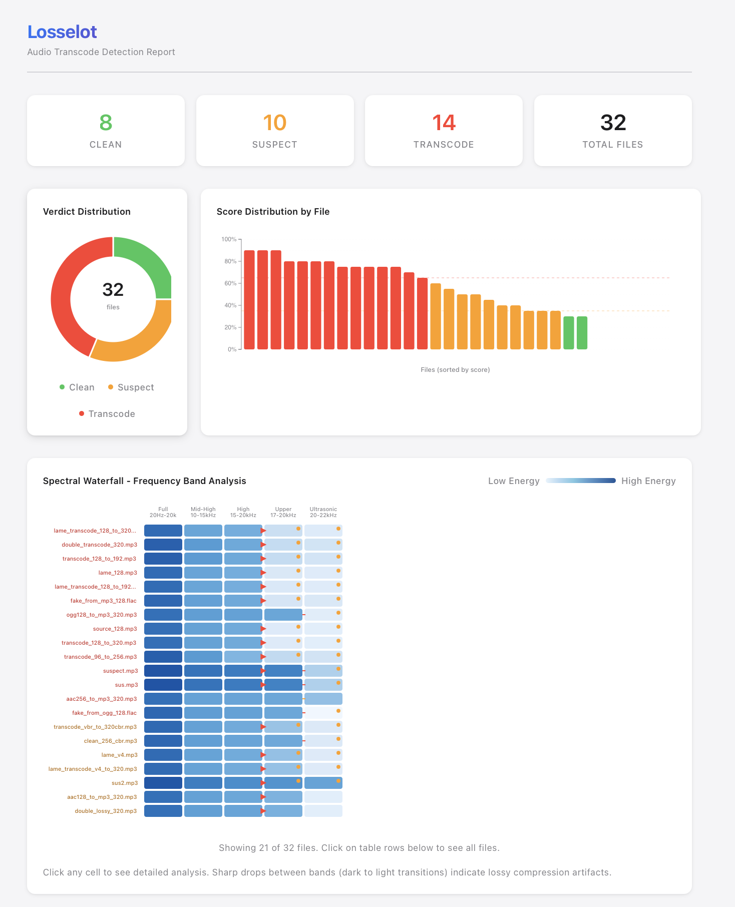
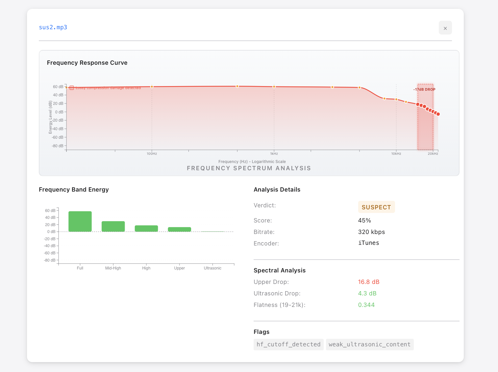
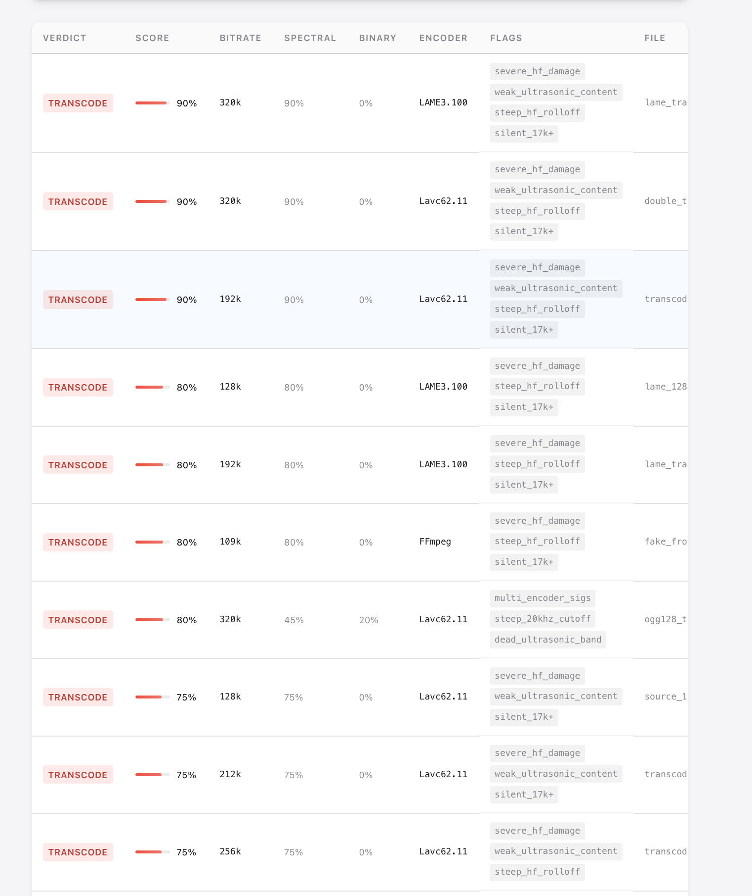

# Losselot

**Find out if your "lossless" audio files are actually lossless.**

Ever downloaded a FLAC or WAV and wondered if it's the real deal, or just an MP3 someone converted? Losselot tells you the truth in seconds.


---

## Download

| Platform | Download | Notes |
|----------|----------|-------|
| **Mac (Apple Silicon)** | [Download](https://github.com/notactuallytreyanastasio/losselot/releases/latest/download/losselot-darwin-arm64) | M1/M2/M3 Macs |
| **Mac (Intel)** | [Download](https://github.com/notactuallytreyanastasio/losselot/releases/latest/download/losselot-darwin-amd64) | Older Macs |
| **Windows** | [Download](https://github.com/notactuallytreyanastasio/losselot/releases/latest/download/losselot-windows-amd64.exe) | Windows 10/11 |
| **Linux (GUI)** | [Download AppImage](https://github.com/notactuallytreyanastasio/losselot/releases/latest/download/losselot-linux-amd64.AppImage) | Double-click to run |
| **Linux (CLI)** | [Download](https://github.com/notactuallytreyanastasio/losselot/releases/latest/download/losselot-linux-amd64) | Terminal only |

---

## How to Use

### Mac & Windows (GUI)

1. **Download** the file for your system
2. **Double-click** it (Mac users: right-click → Open the first time)
3. **Pick a folder** with your audio files
4. **View the report** that opens in your browser

That's it. No installation, no terminal commands.

### Linux AppImage

1. Download the `.AppImage` file
2. Right-click → Properties → Permissions → "Allow executing as program"
3. Double-click to run

---

## Understanding the Report

When Losselot finishes analyzing your files, it opens an interactive HTML report in your browser. Here's what you'll see:

### Overview Dashboard



**At the top:**
- **Summary cards** show how many files are Clean, Suspect, or Transcode at a glance
- **Verdict Distribution** pie chart gives you the big picture of your library's health
- **Score Distribution** bar chart shows every file ranked by how suspicious it is

**The Spectral Waterfall:**
This is where it gets interesting. Each row is one of your files. The columns show different frequency ranges:
- **Full** (20Hz-20kHz) - The whole audible spectrum
- **Mid-High** (10-15kHz) - Usually healthy even in lossy files
- **High** (15-20kHz) - Starts showing damage in lower bitrate MP3s
- **Upper** (17-20kHz) - Where medium bitrate damage shows
- **Ultrasonic** (20-22kHz) - The smoking gun for 320kbps detection

**What to look for:** See those red triangles? Those mark where the frequency energy suddenly drops off. Real lossless audio has smooth gradients across all columns. Transcoded files have sharp cutoffs - that's the "scar" left by lossy compression.

### Detailed File Analysis

Click any file to see its full breakdown:



**Frequency Response Curve:**
This shows exactly where the audio cuts off. The pink shaded area is the frequency content. See how it drops sharply around 17-20kHz with a "-17dB DROP" annotation? That's the telltale sign of lossy compression. Real lossless files have a gentle, natural rolloff.

**The red box labeled "Lossy compression damage detected"** highlights the problem region.

**Frequency Band Energy bars:**
Quick visual of energy in each frequency band. Green bars should stay relatively consistent. If the rightmost bars (Upper, Ultrasonic) are much shorter, something's wrong.

**Analysis Details:**
- **Verdict**: CLEAN, SUSPECT, or TRANSCODE
- **Score**: 0-100% (higher = more likely to be fake)
- **Bitrate**: The file's bitrate
- **Encoder**: What created the file (LAME, iTunes, FFmpeg, etc.)

**Spectral Analysis numbers:**
- **Upper Drop**: How much energy is lost in high frequencies. Clean files: ~4-8 dB. Transcodes: 40+ dB.
- **Ultrasonic Drop**: Energy loss above 20kHz. This catches 320kbps MP3 transcodes.
- **Flatness**: Measures if there's real content or just silence above 20kHz.

**Flags:**
These are the specific problems detected:
- `severe_hf_damage` - Major frequency loss (probably from 128kbps or lower)
- `hf_cutoff_detected` - Clear lossy cutoff pattern found
- `weak_ultrasonic_content` - Not enough content above 20kHz
- `silent_17k+` - Upper frequencies are basically silent

### Results Table



Scroll down to see every file in a sortable table:
- **Verdict** - Color-coded status (green/yellow/red)
- **Score** - Suspicion percentage with visual bar
- **Bitrate** - File's bitrate in kbps
- **Spectral/Binary** - Breakdown of how the score was calculated
- **Encoder** - What program made the file
- **Flags** - All the problems detected
- **File** - The filename

Click any row to jump to that file's detailed analysis.

---

## What the Verdicts Mean

| Verdict | Score | What it means |
|---------|-------|---------------|
| **CLEAN** | 0-34% | Looks like genuine lossless. Natural frequency rolloff, content above 20kHz present. |
| **SUSPECT** | 35-64% | Something's off. Could be from a high-bitrate lossy source (256-320kbps), or just unusual audio content. Worth investigating. |
| **TRANSCODE** | 65-100% | Almost certainly fake. Clear signs of lossy compression damage. The "lossless" file was made from an MP3/AAC. |

---

## Supported File Types

Losselot can analyze: **FLAC, WAV, AIFF, MP3, M4A, AAC, OGG, Opus, ALAC**

The main use case is checking FLAC/WAV files, but it can also detect if an MP3 was transcoded from a lower-quality MP3.

---

## Why This Matters

When you buy or download "lossless" audio, you expect the real thing - the full quality from the original master. But sometimes what you get is just an MP3 that someone converted to FLAC. The problem? **Converting lossy to lossless doesn't bring back lost frequencies.** It's like photocopying a photocopy - the damage is permanent.

Losselot uses spectral analysis to detect this damage. It looks at the frequency content of your files and identifies the "scars" left by lossy compression:
- 128kbps MP3 cuts off at ~16kHz
- 192kbps MP3 cuts off at ~18kHz
- 320kbps MP3 cuts off at ~20kHz

Real lossless audio from a proper source has content all the way up to 22kHz and beyond. When that content is missing, you know something's wrong.

---

## Command Line (Advanced)

For power users who prefer the terminal:

```bash
# Analyze a folder
./losselot ~/Music/

# Analyze a single file
./losselot suspicious-file.flac

# Save report to specific location
./losselot -o report.html ~/Downloads/

# Quick scan without spectral analysis
./losselot --no-spectral ~/Music/

# See all options
./losselot --help
```

**Exit codes for scripting:**
- `0` = All files clean
- `1` = Some files suspect
- `2` = Transcodes detected

---

## Build from Source

```bash
# Requires Rust (https://rustup.rs)
git clone https://github.com/notactuallytreyanastasio/losselot.git
cd losselot
cargo build --release
./target/release/losselot
```

---

## License

MIT - Do whatever you want with it.
