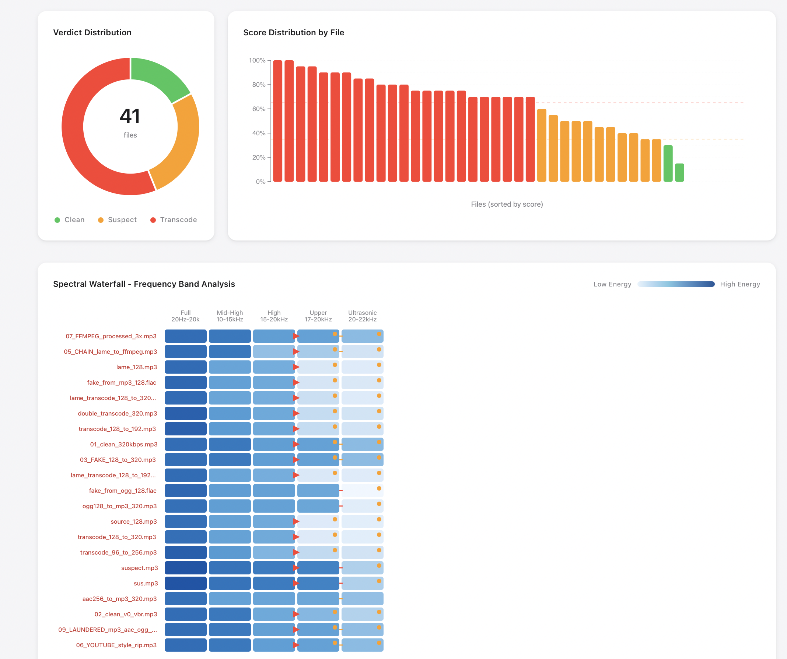
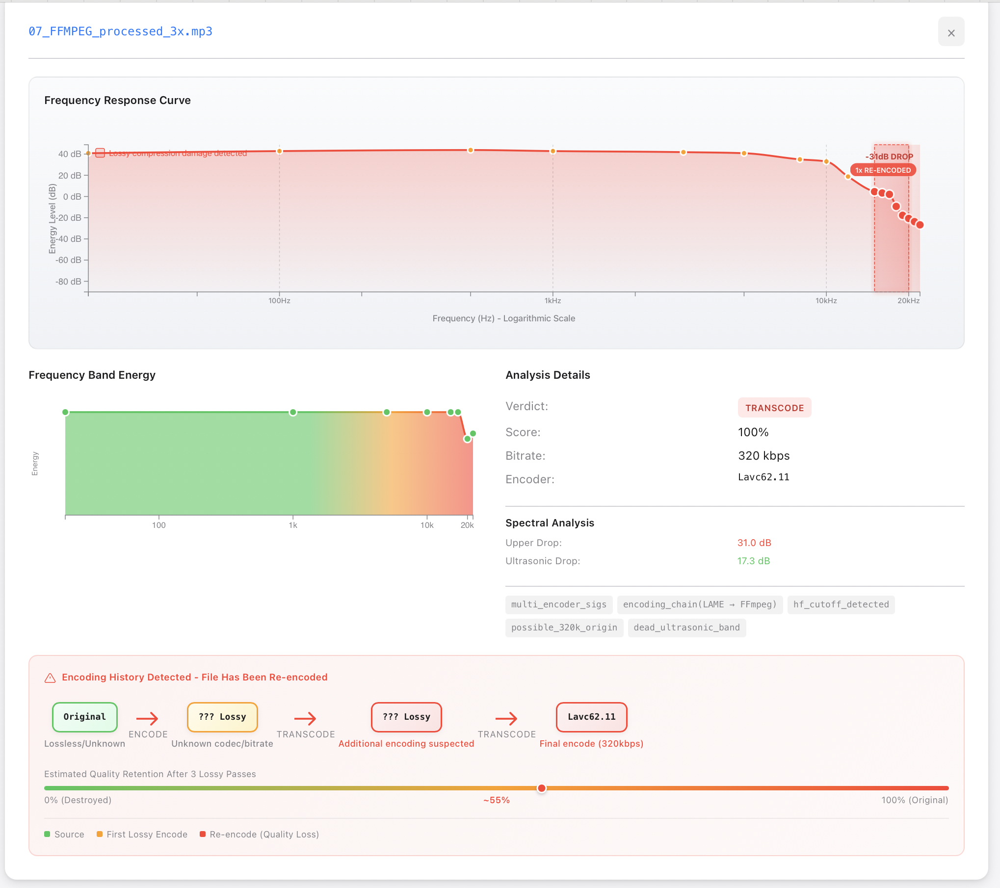
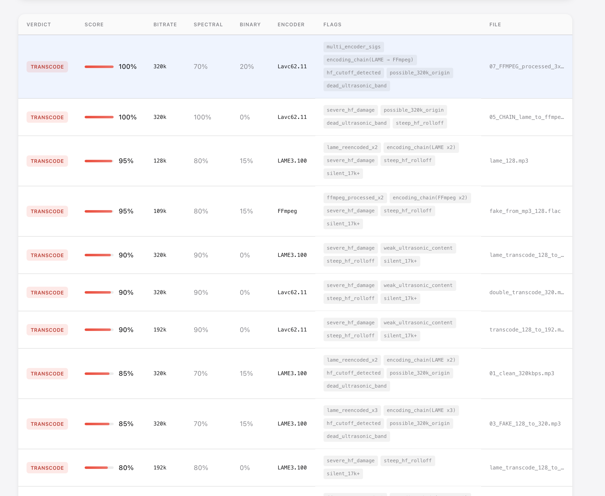

# Losselot

**Find out if your "lossless" audio files are actually lossless.**

Ever downloaded a FLAC or WAV and wondered if it's the real deal, or just an MP3 someone converted? Losselot tells you the truth in seconds.


---

## Download

| Platform | Download | Notes |
|----------|----------|-------|
| **Mac (Apple Silicon)** | [Download](https://github.com/notactuallytreyanastasio/losselot/releases/latest/download/losselot-darwin-arm64) | M1/M2/M3 Macs |
| **Mac (Intel)** | [Download](https://github.com/notactuallytreyanastasio/losselot/releases/latest/download/losselot-darwin-amd64) | Older Macs |
| **Windows** | [Download](https://github.com/notactuallytreyanastasio/losselot/releases/latest/download/losselot-windows-amd64.exe) | Windows 10/11 |
| **Linux (GUI)** | [Download AppImage](https://github.com/notactuallytreyanastasio/losselot/releases/latest/download/losselot-linux-amd64.AppImage) | Double-click to run |
| **Linux (CLI)** | [Download](https://github.com/notactuallytreyanastasio/losselot/releases/latest/download/losselot-linux-amd64) | Terminal only |

---

## How to Use

### Mac & Windows (GUI)

1. **Download** the file for your system
2. **Double-click** it (Mac users: right-click → Open the first time)
3. **Pick a folder** with your audio files
4. **View the report** that opens in your browser

That's it. No installation, no terminal commands.

### Linux AppImage

1. Download the `.AppImage` file
2. Right-click → Properties → Permissions → "Allow executing as program"
3. Double-click to run

---

## Understanding the Report

When Losselot finishes analyzing your files, it opens an interactive HTML report in your browser. Here's what you'll see:

### Overview Dashboard



**At the top:**
- **Summary cards** show how many files are Clean, Suspect, or Transcode at a glance
- **Verdict Distribution** pie chart gives you the big picture of your library's health
- **Score Distribution** bar chart shows every file ranked by how suspicious it is

**The Spectral Waterfall:**
This is where it gets interesting. Each row is one of your files. The columns show different frequency ranges:
- **Full** (20Hz-20kHz) - The whole audible spectrum
- **Mid-High** (10-15kHz) - Usually healthy even in lossy files
- **High** (15-20kHz) - Starts showing damage in lower bitrate MP3s
- **Upper** (17-20kHz) - Where medium bitrate damage shows
- **Ultrasonic** (20-22kHz) - The smoking gun for 320kbps detection

**What to look for:** See those red/orange dots? Those mark where the frequency energy suddenly drops off. Real lossless audio has smooth gradients across all columns. Transcoded files have sharp cutoffs - that's the "scar" left by lossy compression.

### Detailed File Analysis

Click any file to see its full breakdown:



**Frequency Response Curve:**
This shows exactly where the audio cuts off. The pink shaded area is the frequency content. See how it drops sharply around 17-20kHz with a "-31dB DROP" annotation? That's the telltale sign of lossy compression. Real lossless files have a gentle, natural rolloff.

The **"1x RE-ENCODED"** badge indicates this file has been through multiple encoding passes.

**Frequency Band Energy:**
Quick visual of energy in each frequency band as a waveform. The gradient shows energy distribution - green is healthy, red indicates problem areas at high frequencies.

**Analysis Details:**
- **Verdict**: CLEAN, SUSPECT, or TRANSCODE
- **Score**: 0-100% (higher = more likely to be fake)
- **Bitrate**: The file's bitrate
- **Encoder**: What created the file (LAME, FFmpeg, iTunes, etc.)

**Spectral Analysis numbers:**
- **Upper Drop**: How much energy is lost in high frequencies. Clean files: ~4-8 dB. Transcodes: 30+ dB.
- **Ultrasonic Drop**: Energy loss above 20kHz. This catches 320kbps MP3 transcodes.

### Encoding Chain Detection

**This is new.** Losselot now detects when a file has been re-encoded multiple times - even if someone tried to "upgrade" it to a higher bitrate.


**The Encoding History Timeline:**
At the bottom of the analysis panel, you'll see a visual chain showing the file's journey:

```
Original → ??? Lossy → ??? Lossy → LAME3.100
          (Unknown)   (Additional    (Final encode
                      encoding       320kbps)
                      suspected)
```

**What this catches:**
- Files encoded multiple times by LAME (shows `lame_reencoded_x2`, `lame_reencoded_x3`)
- Files that went through different encoders (shows `encoding_chain(LAME → FFmpeg)`)
- Files "laundered" through multiple formats (MP3 → AAC → OGG → MP3)
- The exact number of lossy passes detected

**Estimated Quality Retention:**
The progress bar shows how much quality is theoretically left after multiple lossy passes. Each pass degrades the audio further - you can't get quality back by re-encoding at a higher bitrate.

### Quick View Modal

Click any row in the results table for a compact summary:


This modal shows the key stats at a glance:
- Score, bitrate, encoder, and lowpass frequency
- Any detected flags
- The encoding chain visualization (when transcoding evidence exists)

### Results Table



Scroll down to see every file in a sortable table:
- **Verdict** - Color-coded status (green/yellow/red)
- **Score** - Suspicion percentage with visual bar
- **Bitrate** - File's bitrate in kbps
- **Spectral/Binary** - Breakdown of how the score was calculated
- **Encoder** - What program made the file
- **Flags** - All the problems detected (see flags table below)
- **File** - The filename

Click any row to open the quick view modal for that file.

---

## What the Verdicts Mean

| Verdict | Score | What it means |
|---------|-------|---------------|
| **CLEAN** | 0-34% | Looks like genuine lossless. Natural frequency rolloff, content above 20kHz present, single encoding pass. |
| **SUSPECT** | 35-64% | Something's off. Could be from a high-bitrate lossy source (256-320kbps), unusual audio content, or possible re-encoding. Worth investigating. |
| **TRANSCODE** | 65-100% | Almost certainly fake. Clear signs of lossy compression damage, or detected re-encoding chain. The "lossless" file was made from an MP3/AAC. |

---

## Understanding the Flags

Losselot tags files with specific flags to explain exactly what it found:

### Spectral Flags

| Flag | What it means |
|------|---------------|
| `severe_hf_damage` | Major frequency loss (probably from 128kbps or lower source) |
| `hf_cutoff_detected` | Clear lossy cutoff pattern found in high frequencies |
| `weak_ultrasonic_content` | Not enough content above 20kHz for claimed quality |
| `dead_ultrasonic_band` | Virtually no content in ultrasonic range - smoking gun |
| `silent_17k+` | Upper frequencies are basically silent |
| `steep_hf_rolloff` | Unnaturally sharp frequency cutoff |
| `possible_320k_origin` | Pattern matches 320kbps MP3 source |

### Re-encoding Flags

| Flag | What it means |
|------|---------------|
| `multi_encoder_sigs` | Multiple different encoder signatures detected in file |
| `encoding_chain(LAME → FFmpeg)` | File was encoded by LAME, then processed by FFmpeg |
| `lame_reencoded_x2` | LAME encoder signatures found 2 times (re-encoded once) |
| `lame_reencoded_x3` | LAME encoder signatures found 3 times (re-encoded twice) |
| `ffmpeg_processed_x2` | FFmpeg processed this file multiple times |
| `fraunhofer_reencoded_x2` | Fraunhofer encoder signatures found multiple times |
| `encoder_gogo` | GOGO encoder detected |
| `encoder_bladeenc` | BladeEnc encoder detected |
| `encoder_shine` | Shine encoder detected |
| `encoder_helix` | Helix/RealNetworks encoder detected |

### Binary Analysis Flags

| Flag | What it means |
|------|---------------|
| `lowpass_bitrate_mismatch` | The lowpass frequency doesn't match the claimed bitrate |
| `encoder_quality_mismatch` | Encoder settings don't match file quality |

---

## Supported File Types

Losselot can analyze: **FLAC, WAV, AIFF, MP3, M4A, AAC, OGG, Opus, ALAC**

The main use case is checking FLAC/WAV files, but it can also detect:
- If an MP3 was transcoded from a lower-quality MP3
- If a file has been re-encoded multiple times
- If someone "laundered" audio through multiple format conversions

---

## How Detection Works

Losselot uses three complementary methods to catch fake lossless files:

### 1. Spectral Analysis

Looks at the actual frequency content of your audio. Lossy codecs like MP3 remove high frequencies to save space:

| Source Quality | Typical Cutoff |
|----------------|----------------|
| 128kbps MP3 | ~16kHz |
| 192kbps MP3 | ~18kHz |
| 256kbps MP3 | ~19kHz |
| 320kbps MP3 | ~20kHz |
| True Lossless | ~22kHz (full range) |

Real lossless audio has content all the way up to 22kHz. When that content is missing, you know something's wrong. The "scars" from lossy compression are permanent - converting an MP3 to FLAC doesn't bring back lost frequencies.

### 2. Binary Analysis (MP3 files)

For MP3 files, Losselot reads the encoder metadata embedded in the file. The LAME encoder stores a "lowpass" value that reveals the original encoding settings.

**The smoking gun:** A "320kbps" MP3 with a lowpass of 16kHz was definitely transcoded from a 128kbps source. The encoder honestly reports what frequencies it kept, even when someone re-encoded to a higher bitrate.

### 3. Re-encoding Detection

**New in this version.** Losselot now scans for multiple encoder signatures in the file header:

- **LAME signatures**: Counts occurrences of LAME encoder tags
- **FFmpeg/Lavf signatures**: Detects FFmpeg processing
- **Fraunhofer signatures**: Detects Fraunhofer/FhG encoder
- **Other encoders**: GOGO, BladeEnc, Shine, Helix, iTunes
- **Mixed chains**: Identifies when files pass through different encoders

**Why this matters:** Each lossy encoding pass causes cumulative damage. A file encoded at 128kbps, then "upgraded" to 320kbps, then converted to FLAC still only has 128kbps worth of actual audio quality. The re-encoding detection catches this "laundering" even when the spectral damage is subtle.

**How it works:**
```
Original WAV → MP3 128k (LAME) → WAV → MP3 320k (LAME)
                  ↓                        ↓
           LAME signature #1         LAME signature #2
```

When Losselot finds multiple encoder signatures, it knows the file has been re-encoded and flags it accordingly.

---

## The Compression Journey Problem

Here's a common scenario Losselot now catches:

1. Someone downloads a 128kbps MP3
2. They convert it to WAV (thinking this makes it "lossless")
3. They encode it as 320kbps MP3 (thinking this "upgrades" the quality)
4. They convert to FLAC (thinking this makes it "true lossless")

**The result:** A FLAC file with 128kbps MP3 quality, but appearing to be lossless.

**What Losselot sees:**
- Spectral cutoff at ~16kHz (128kbps source)
- Multiple encoder signatures in the chain
- Dead ultrasonic band
- Steep high-frequency rolloff

**The verdict:** TRANSCODE with encoding chain visualization showing the file's journey.

---

## Command Line (Advanced)

For power users who prefer the terminal:

```bash
# Analyze a folder
./losselot ~/Music/

# Analyze a single file
./losselot suspicious-file.flac

# Save report to specific location
./losselot -o report.html ~/Downloads/

# Quick scan without spectral analysis
./losselot --no-spectral ~/Music/

# See all options
./losselot --help
```

**Exit codes for scripting:**
- `0` = All files clean
- `1` = Some files suspect
- `2` = Transcodes detected

---

## Build from Source

```bash
# Requires Rust (https://rustup.rs)
git clone https://github.com/notactuallytreyanastasio/losselot.git
cd losselot
cargo build --release
./target/release/losselot
```

### Generate Test Files

Want to test the detection? Generate sample files with various encoding scenarios:

```bash
cd examples
./generate_test_files.sh
```

This creates files demonstrating:
- Clean 320kbps and V0 VBR encodes
- 128kbps transcoded to 320kbps (classic fake)
- Multiple LAME re-encoding passes
- LAME → FFmpeg encoding chains
- YouTube-style rips (AAC → MP3)
- Multi-codec laundering (MP3 → AAC → OGG → MP3)

---

## License

MIT - Do whatever you want with it.
